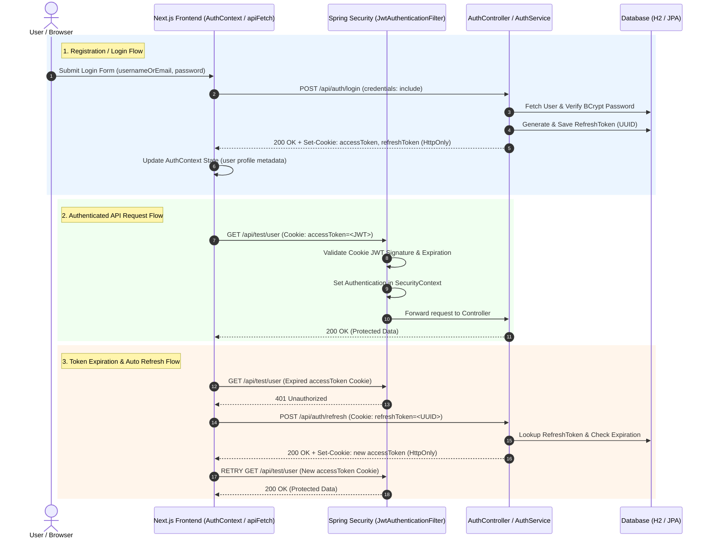

# Complete Authentication System Documentation

This document provides a comprehensive end-to-end specification and architectural overview of the **Authentication and Authorization Process** implemented across the **Spring Boot Backend** (`attendance`) and **Next.js Frontend** (`attendance-frontend`).

---

## 1. System Architecture & High-Level Flow

The system uses a **Secure HttpOnly Cookie Dual-Token Authentication Model**:
* **Short-Lived Access Token (JWT)**: Set in an `HttpOnly`, `SameSite=Lax` cookie (`accessToken`, `Path=/`). Automatically attached to cross-origin requests via `credentials: 'include'`.
* **Long-Lived Refresh Token (UUID)**: Stored securely in the database and in an `HttpOnly`, `SameSite=Lax` cookie (`refreshToken`, `Path=/api/auth`). Used to obtain a new Access Token automatically without storing sensitive tokens in `localStorage`.

---

## 2. Technology Stack, Libraries & Plugins

### 2.1 Backend (`attendance`)
* **Java Runtime**: JDK 21
* **Framework**: Spring Boot `3.3.0`
* **Security Framework**: Spring Boot Starter Security (`spring-boot-starter-security`)
* **JWT Token Library**: JJWT `0.12.6`
  * `io.jsonwebtoken:jjwt-api`: Core interfaces and API
  * `io.jsonwebtoken:jjwt-impl`: Runtime implementation
  * `io.jsonwebtoken:jjwt-jackson`: Jackson JSON serializer/deserializer integration for JWT claims
* **Database & Persistence**: Spring Boot Starter Data JPA, Oracle Database (`com.oracle.database.jdbc:ojdbc11`), H2 Database Engine for test environment (`com.h2database:h2`)
* **Validation**: Spring Boot Starter Validation (`jakarta.validation`)
* **Code Generation & Boilerplate**: Project Lombok `1.18.38`
* **Build Tool & Plugins**:
  * Apache Maven `3.x` / Maven Wrapper (`mvnw.cmd`)
  * `spring-boot-maven-plugin`: Spring Boot packaging and execution
  * `maven-compiler-plugin`: Configured with annotation processing path for Lombok JDK 21 support

### 2.2 Frontend (`attendance-frontend`)
* **Framework**: Next.js `16.2.12` (App Router architecture with React 19)
* **UI Library**: React `19.2.4` / React DOM `19.2.4`
* **HTTP & State**: Native `fetch` API (`credentials: 'include'`) wrapped in custom context provider (`AuthContext`)
* **Build & Dev Tools**: Turbopack, ESLint `9` with `eslint-config-next`

---

## 3. API Endpoints Specification

Base URL: `http://localhost:8080/api` (Configurable via `NEXT_PUBLIC_API_URL`)

| Endpoint | HTTP Method | Access Level | Description |
| :--- | :--- | :--- | :--- |
| `/api/auth/register` | `POST` | Public | Register user & return HttpOnly cookies |
| `/api/auth/login` | `POST` | Public | Authenticate user & return HttpOnly cookies |
| `/api/auth/refresh` | `POST` | Public | Refresh `accessToken` cookie using `refreshToken` cookie |
| `/api/auth/logout` | `POST` | Authenticated | Clear HttpOnly cookies & revoke refresh token |
| `/api/auth/me` | `GET` | Authenticated | Fetch current user profile details via cookie |
| `/api/test/public` | `GET` | Public | Unrestricted test endpoint |
| `/api/test/user` | `GET` | Authenticated (`ROLE_USER`, `ROLE_ADMIN`) | User-level test endpoint |
| `/api/test/admin` | `GET` | Authenticated (`ROLE_ADMIN`) | Admin-level test endpoint |

---

## 4. Backend Source File Directory & Responsibilities

Location: `attendance/src/main/java/com/cmh/attendance/`

### 4.1 Security & Filter Layer (`security/`)
* **[SecurityConfig.java](file:///d:/projects/attendance/attendance/src/main/java/com/cmh/attendance/security/SecurityConfig.java)**
  * Configures Spring Security filter chain (`SecurityFilterChain`).
  * Enforces stateless session policy (`SessionCreationPolicy.STATELESS`).
  * Configures CORS bean with `setAllowCredentials(true)` allowing browser cookie transmission.

* **[JwtAuthenticationFilter.java](file:///d:/projects/attendance/attendance/src/main/java/com/cmh/attendance/security/JwtAuthenticationFilter.java)**
  * Intercepts HTTP requests (`OncePerRequestFilter`).
  * Extracts JWT token from the `accessToken` Cookie in `request.getCookies()`, with fallback to `Authorization: Bearer` header.
  * Validates JWT token and sets `UsernamePasswordAuthenticationToken` into `SecurityContextHolder`.

---

### 4.2 Business Service Layer & Controllers (`service/`, `controller/`)
* **[AuthController.java](file:///d:/projects/attendance/attendance/src/main/java/com/cmh/attendance/controller/AuthController.java)**
  * Returns `ResponseCookie` headers (`Set-Cookie`) for `accessToken` (`Path=/`, `HttpOnly`, `SameSite=Lax`) and `refreshToken` (`Path=/api/auth`, `HttpOnly`, `SameSite=Lax`).
  * `/api/auth/refresh`: Reads incoming `refreshToken` Cookie if request body is empty.
  * `/api/auth/logout`: Clears both cookies (`Max-Age=0`).

---

## 5. Frontend Source File Directory & Responsibilities

Location: `attendance-frontend/src/`

* **[src/lib/api.js](file:///d:/projects/attendance/attendance-frontend/src/lib/api.js)**
  * `apiFetch` attaches `credentials: 'include'` to every request.
  * Eliminates `localStorage` token parsing.
  * On HTTP 401, calls `/auth/refresh` with `credentials: 'include'` to auto-refresh cookies.

* **[src/context/AuthContext.js](file:///d:/projects/attendance/attendance-frontend/src/context/AuthContext.js)**
  * Manages user profile state in React context.
  * Checks authentication on mount via `/api/auth/me` cookie call.
