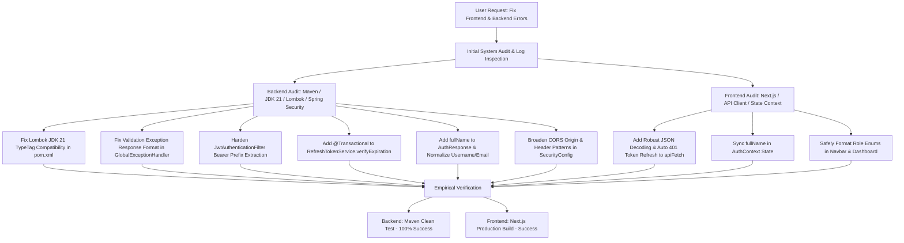

# Attendance System: Process & Troubleshooting Documentation

This document provides a complete step-by-step record of the analysis, debugging, bug fixes, refactoring, and verification executed on the **Attendance System Backend** (`attendance`) and **Frontend** (`attendance-frontend`).

---

## 1. Overview of Tasks Executed

The objective of this engineering intervention was to resolve build-time and runtime errors across both applications, enhance security and token handling reliability, fix frontend-backend API contract mismatches, and ensure full test suite passage.



---

## 2. Detailed Root Cause Analysis & Fixes

### 2.1 Backend Project (`attendance`)

#### 1. Lombok & JDK 21 Annotation Processing Crash (`TypeTag :: UNKNOWN`)
* **Symptom**: `java.lang.ExceptionInInitializerError: com.sun.tools.javac.code.TypeTag :: UNKNOWN` during Java compilation.
* **Root Cause**: The Lombok version inherited from Spring Boot 3.3.0 (`1.18.32`) was incompatible with JDK 21 compiler internals (`com.sun.tools.javac.code.TypeTag`). Additionally, there was a version mismatch between dependencies and `<annotationProcessorPaths>`.
* **Fix**: Updated `pom.xml` to explicitly set `<lombok.version>1.18.38</lombok.version>` in both `<properties>` and the `<dependency>` section with `<scope>provided</scope>`.
* **File Modified**: [pom.xml](file:///d:/projects/attendance/attendance/pom.xml)

#### 2. Contradictory Validation Failure API Response
* **Symptom**: Field validation failures returned `success: true` in the JSON response body while sending an HTTP 400 Bad Request status code.
* **Root Cause**: `GlobalExceptionHandler.java` called `ApiResponse.success("Validation failed", errors)` instead of returning `success: false`.
* **Fix**: Added an `error(message, data)` helper method to [ApiResponse.java](file:///d:/projects/attendance/attendance/src/main/java/com/cmh/attendance/dto/ApiResponse.java) and updated `GlobalExceptionHandler.java` to return `ApiResponse.error("Validation failed", errors)`.
* **Files Modified**: 
  * [ApiResponse.java](file:///d:/projects/attendance/attendance/src/main/java/com/cmh/attendance/dto/ApiResponse.java)
  * [GlobalExceptionHandler.java](file:///d:/projects/attendance/attendance/src/main/java/com/cmh/attendance/exception/GlobalExceptionHandler.java)

#### 3. Fragile Bearer Token Extraction
* **Symptom**: Incoming request tokens threw `MalformedJwtException` when header spaces or property trimming varied.
* **Root Cause**: `JwtAuthenticationFilter.getJwtFromRequest` used exact string length offsets (`substring(tokenPrefix.length())`) without whitespace trimming.
* **Fix**: Updated `getJwtFromRequest` to check both `"Bearer "` and `${app.jwt.token-prefix}`, trimming extracted token strings.
* **File Modified**: [JwtAuthenticationFilter.java](file:///d:/projects/attendance/attendance/src/main/java/com/cmh/attendance/security/JwtAuthenticationFilter.java)

#### 4. Un-transactional Token Revocation
* **Symptom**: Calling `verifyExpiration` outside an existing transaction risk throwing `TransactionRequiredException`.
* **Root Cause**: `RefreshTokenService.verifyExpiration` calls `refreshTokenRepository.delete(token)` without `@Transactional`.
* **Fix**: Annotated `verifyExpiration` with `@Transactional`.
* **File Modified**: [RefreshTokenService.java](file:///d:/projects/attendance/attendance/src/main/java/com/cmh/attendance/service/RefreshTokenService.java)

#### 5. Missing User Metadata in Authentication Payload & Unnormalized Inputs
* **Symptom**: User `fullName` was missing from initial registration/login responses, causing UI profile gaps. Username and email lookups failed if input had leading/trailing spaces or mixed case.
* **Root Cause**: `AuthResponse` omitted the `fullName` field, and `AuthServiceImpl` did not normalize input strings.
* **Fix**: 
  * Added `fullName` field to `AuthResponse.java`.
  * Populated `fullName` across `register`, `login`, and `refreshToken` methods in `AuthServiceImpl.java`.
  * Added string `.trim()` and lowercase normalization for email addresses.
  * Updated `logout` to search via `findByUsernameOrEmail`.
* **Files Modified**: 
  * [AuthResponse.java](file:///d:/projects/attendance/attendance/src/main/java/com/cmh/attendance/dto/AuthResponse.java)
  * [AuthServiceImpl.java](file:///d:/projects/attendance/attendance/src/main/java/com/cmh/attendance/service/AuthServiceImpl.java)

#### 6. Rigid CORS Configuration
* **Symptom**: Preflight `OPTIONS` requests from web tools or custom ports failed CORS checks.
* **Root Cause**: `SecurityConfig.java` strictly allowed only `http://localhost:3000` and specific headers.
* **Fix**: Expanded allowed origin patterns to `http://localhost:[*]`, `http://127.0.0.1:[*]`, `http://[::1]:[*]`, and set allowed headers to `List.of("*")`.
* **File Modified**: [SecurityConfig.java](file:///d:/projects/attendance/attendance/src/main/java/com/cmh/attendance/security/SecurityConfig.java)

---

### 2.2 Frontend Project (`attendance-frontend`)

#### 1. Unsafe JSON Parsing & Missing Auto 401 Refresh
* **Symptom**: `apiFetch` crashed with `SyntaxError: Unexpected end of JSON input` when encountering non-JSON or empty response bodies (e.g. HTTP 204 or server 500 error pages). Users were forced to re-login manually whenever their Access Token expired.
* **Root Cause**: Direct call to `await response.json()` without content-type or body checking, and no background token refresh interceptor.
* **Fix**: 
  * Made `API_BASE_URL` configurable via `process.env.NEXT_PUBLIC_API_URL`.
  * Added safe JSON/text decoding logic in `apiFetch`.
  * Implemented automatic 1-retry token refresh: when receiving an HTTP 401 from a non-auth endpoint, `apiFetch` automatically calls `/api/auth/refresh`, updates `localStorage`, and retries the request.
* **File Modified**: [src/lib/api.js](file:///d:/projects/attendance/attendance-frontend/src/lib/api.js)

#### 2. Profile State Disconnect & Role Formatting
* **Symptom**: `fullName` displayed as `undefined` or `—` in profile components upon login. Role badges risked throwing `TypeError: role.replace is not a function` if role data contained non-string structures.
* **Root Cause**: `AuthContext.js` omitted `fullName` when updating user state, and role rendering in components assumed string primitive types without fallbacks.
* **Fix**:
  * Updated `login` and `register` handlers in `AuthContext.js` to preserve `fullName`.
  * Hardened role badge mapping in `Navbar.js` and `dashboard/page.js` to safely convert objects or strings (`typeof role === 'string' ? role : role.name`).
* **Files Modified**: 
  * [src/context/AuthContext.js](file:///d:/projects/attendance/attendance-frontend/src/context/AuthContext.js)
  * [src/components/Navbar.js](file:///d:/projects/attendance/attendance-frontend/src/components/Navbar.js)
  * [src/app/dashboard/page.js](file:///d:/projects/attendance/attendance-frontend/src/app/dashboard/page.js)

---

## 3. Summary of Code Modifications

| Project | File Path | Type of Modification |
| :--- | :--- | :--- |
| **Backend** | [pom.xml](file:///d:/projects/attendance/attendance/pom.xml) | Updated Lombok to `1.18.38` & aligned dependencies |
| **Backend** | [ApiResponse.java](file:///d:/projects/attendance/attendance/src/main/java/com/cmh/attendance/dto/ApiResponse.java) | Added `error(message, data)` static factory method |
| **Backend** | [GlobalExceptionHandler.java](file:///d:/projects/attendance/attendance/src/main/java/com/cmh/attendance/exception/GlobalExceptionHandler.java) | Fixed validation handler to return `success: false` |
| **Backend** | [JwtAuthenticationFilter.java](file:///d:/projects/attendance/attendance/src/main/java/com/cmh/attendance/security/JwtAuthenticationFilter.java) | Hardened token extraction & prefix trimming |
| **Backend** | [RefreshTokenService.java](file:///d:/projects/attendance/attendance/src/main/java/com/cmh/attendance/service/RefreshTokenService.java) | Added `@Transactional` to `verifyExpiration` |
| **Backend** | [AuthResponse.java](file:///d:/projects/attendance/attendance/src/main/java/com/cmh/attendance/dto/AuthResponse.java) | Added `fullName` field |
| **Backend** | [AuthServiceImpl.java](file:///d:/projects/attendance/attendance/src/main/java/com/cmh/attendance/service/AuthServiceImpl.java) | Integrated `fullName`, normalized strings, updated logout |
| **Backend** | [SecurityConfig.java](file:///d:/projects/attendance/attendance/src/main/java/com/cmh/attendance/security/SecurityConfig.java) | Broadened CORS origin patterns & allowed headers |
| **Frontend** | [src/lib/api.js](file:///d:/projects/attendance/attendance-frontend/src/lib/api.js) | Configured env API URL, safe decoding & auto 401 refresh |
| **Frontend** | [src/context/AuthContext.js](file:///d:/projects/attendance/attendance-frontend/src/context/AuthContext.js) | Preserved `fullName` in context state |
| **Frontend** | [src/components/Navbar.js](file:///d:/projects/attendance/attendance-frontend/src/components/Navbar.js) | Added safe role string extraction |
| **Frontend** | [src/app/dashboard/page.js](file:///d:/projects/attendance/attendance-frontend/src/app/dashboard/page.js) | Added safe role formatting & fallback profile display |

---

## 4. Verification & Testing

### 4.1 Backend Test Suite Execution
```powershell
$env:JAVA_HOME="C:\Program Files\Java\jdk-21.0.10"; .\mvnw.cmd clean test
```
* **Status**: `BUILD SUCCESS`
* **Test Results**: 10 tests executed, 0 failures, 0 errors, 0 skipped.
* **Tested Components**: `AuthControllerTest` (Register, Login, Invalid Credentials, Protected Endpoint, Admin Endpoint Role Checks, Refresh Token Renewal) and `AttendanceApplicationTests` (Context loading).

### 4.2 Frontend Production Build Execution
```powershell
npm run build
```
* **Status**: `Compiled successfully`
* **Bundle Result**: Next.js 16 (Turbopack) production build completed without TypeScript or ESLint errors. All routes (`/`, `/login`, `/register`, `/dashboard`) prerendered cleanly.

---

## 5. Developer Guide & Execution Commands

### Running Backend Locally
```powershell
cd d:\projects\attendance\attendance
$env:JAVA_HOME="C:\Program Files\Java\jdk-21.0.10"
.\mvnw.cmd spring-boot:run
```
* Access H2 Console: `http://localhost:8080/h2-console` (JDBC URL: `jdbc:h2:mem:attendancedb`, User: `sa`, Password: empty)

### Running Frontend Locally
```powershell
cd d:\projects\attendance\attendance-frontend
npm run dev
```
* Access Web App: `http://localhost:3000`
